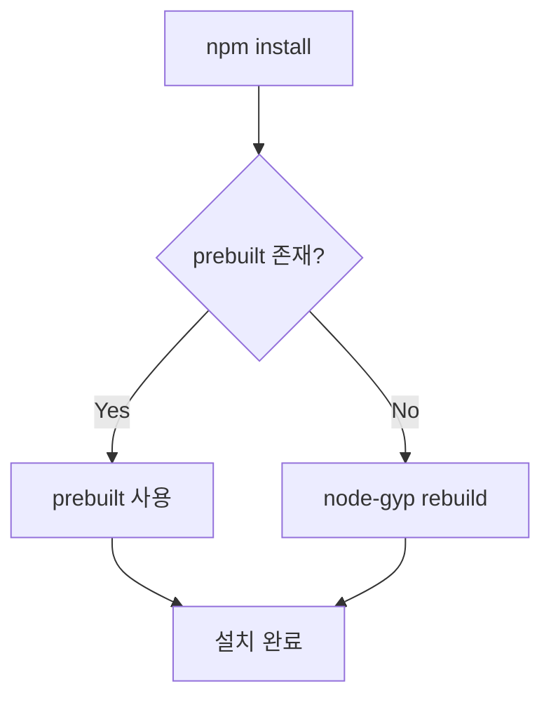
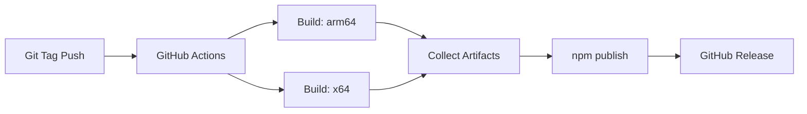

# 크로스플랫폼 빌드 및 배포 가이드

## 개요

`iohook-macos`는 이제 Apple Silicon (arm64)과 Intel (x64) 아키텍처 모두를 지원하는 prebuilt 바이너리를 제공합니다. 이 가이드는 크로스플랫폼 대응 구조와 배포 프로세스를 설명합니다.

## 아키텍처 지원

### 지원되는 플랫폼

- **macOS (darwin)**: 필수
  - **Apple Silicon (arm64)**: M1, M2, M3 등
  - **Intel (x64)**: Intel 기반 Mac

### 바이너리 구조

```
iohook-macos/
├── prebuilds/
│   ├── darwin-arm64/          # Apple Silicon용
│   │   └── iohook-macos.node
│   └── darwin-x64/            # Intel Mac용
│       └── iohook-macos.node
├── build/
│   └── Release/
│       └── iohook-macos.node  # 로컬 빌드
└── index.js
```

## 설치 프로세스

### 자동 바이너리 선택

사용자가 `npm install iohook-macos`를 실행하면:

1. **node-gyp-build**가 현재 시스템에 맞는 prebuilt 바이너리 검색
2. **적절한 바이너리 발견 시**: 즉시 사용 (빌드 불필요)
3. **바이너리 없을 시**: node-gyp rebuild로 자동 빌드 (fallback)



### Fallback 메커니즘

[`index.js`](index.js:4-47)는 여러 경로를 순차적으로 시도합니다:

1. `node-gyp-build()` - prebuilt 바이너리
2. `./build/Release/iohook-macos.node` - 로컬 빌드
3. `./prebuilds/darwin-arm64/iohook-macos.node` - arm64 직접 경로
4. `./prebuilds/darwin-x64/iohook-macos.node` - x64 직접 경로

모든 경로가 실패하면 상세한 오류 메시지를 표시합니다.

## 개발 워크플로우

### 로컬 개발

#### Apple Silicon (M1/M2/M3) Mac에서

```bash
# 현재 아키텍처용 빌드
npm run rebuild

# 또는 prebuildify로 prebuilt 생성
npm run prebuild
```

#### Intel Mac에서

```bash
# Intel 아키텍처용 빌드
npm run rebuild

# 또는 prebuildify로 prebuilt 생성
npm run prebuild
```

#### 양쪽 아키텍처 모두 빌드 (Rosetta 필요)

```bash
# 모든 아키텍처용 prebuilt 생성
npm run prebuild-all
```

### 테스트

```bash
# 기본 CI 테스트
npm test

# 포괄적 테스트
npm run test-comprehensive

# 성능 테스트
npm run test-performance
```

## 배포 프로세스

### 자동 배포 (권장)

#### 버전 릴리스

```bash
# Patch 릴리스 (1.0.0 → 1.0.1)
npm run release:patch

# Minor 릴리스 (1.0.0 → 1.1.0)
npm run release:minor

# Major 릴리스 (1.0.0 → 2.0.0)
npm run release:major
```

이 명령은 자동으로:
1. 테스트 실행
2. 버전 번호 업데이트
3. Git 태그 생성 및 푸시
4. GitHub Actions 트리거

#### GitHub Actions 워크플로우

[`.github/workflows/release.yml`](.github/workflows/release.yml:1) 파일은:

1. **Multi-architecture 빌드**
   - `macos-latest` (arm64) runner에서 빌드
   - `macos-13` (x64) runner에서 빌드
   - 각 prebuilt 바이너리를 artifacts로 업로드

2. **패키징 및 배포**
   - 모든 artifacts 다운로드
   - `prebuilds/` 디렉토리에 통합
   - npm에 퍼블리시
   - GitHub Release 생성



### 수동 배포

필요한 경우 수동으로 배포:

```bash
# 1. 모든 아키텍처 빌드
npm run prebuild-all

# 2. 테스트
npm test

# 3. 패키지 내용 확인
npm run publish:check

# 4. npm 배포
npm publish
```

## CI/CD 설정

### GitHub Secrets

다음 secrets 설정 필요:
- `NPM_TOKEN`: npm 배포용 인증 토큰

### GitHub Actions Runners

- **macos-latest**: Apple Silicon (arm64)
- **macos-13**: Intel (x64)

## 패키지 내용

### npm에 포함되는 파일

[`package.json`](package.json:7-16):
```json
"files": [
  "index.js",
  "index.d.ts",
  "bin/",
  "build/Release/*.node",
  "LICENSE",
  "README.md",
  "README.ko.md",
  "CHANGELOG.md"
]
```

### .gitignore 설정

[`.gitignore`](.gitignore:10-21):
- 대부분의 `*.node` 파일 무시
- **단, `prebuilds/**/*.node`는 예외** (배포를 위해 포함)

## 문제 해결

### Intel Mac에서 설치 실패

**증상**: `binding.gyp` 관련 오류

**원인**:
- prebuilt 바이너리가 npm 패키지에 없음
- node-gyp가 자동으로 빌드 시도하지만 실패

**해결책**:
1. 배포 시 prebuilt 바이너리가 포함되었는지 확인
2. 로컬에서 재빌드: `npm run rebuild`

### Apple Silicon에서 Intel 바이너리 사용

**증상**: 아키텍처 불일치 오류

**원인**: 잘못된 아키텍처의 prebuilt 로드

**해결책**:
- `node-gyp-build`가 자동으로 올바른 바이너리 선택
- 문제 지속 시: `npm run rebuild`로 현재 아키텍처용 빌드

### GitHub Actions 빌드 실패

**확인 사항**:
1. Xcode Command Line Tools 설치 확인
2. `npm ci`가 성공했는지 확인
3. Node.js 버전 호환성 (14+)

## 스크립트 레퍼런스

### package.json scripts

| 스크립트 | 설명 |
|---------|-----|
| `install` | node-gyp-build를 사용한 자동 바이너리 로드 |
| `rebuild` | 현재 아키텍처용 네이티브 모듈 빌드 |
| `prebuild` | 현재 아키텍처용 prebuilt 생성 |
| `prebuild-all` | 모든 아키텍처용 prebuilt 생성 |
| `prepublishOnly` | 배포 전 모든 prebuilt 생성 및 테스트 |

## 베스트 프랙티스

### 개발자

1. **로컬 개발**: `npm run rebuild` 사용
2. **테스트**: 변경 전 테스트 실행
3. **커밋 전**: CI 테스트 통과 확인

### 배포 담당자

1. **자동 배포 사용**: `npm run release:*` 명령
2. **수동 검증**: `npm run publish:check`로 패키지 내용 확인
3. **아키텍처 확인**: 양쪽 prebuilt가 포함되었는지 확인

### 사용자

1. **설치 문제**: 먼저 `npm run rebuild` 시도
2. **권한 문제**: macOS Accessibility 권한 확인
3. **호환성**: macOS 10.15+ 및 Node.js 14+ 필요

## 추가 리소스

- [Node-API 문서](https://nodejs.org/api/n-api.html)
- [node-gyp-build](https://github.com/prebuild/node-gyp-build)
- [prebuildify](https://github.com/prebuild/prebuildify)
- [macOS Core Graphics](https://developer.apple.com/documentation/coregraphics/)

## 버전 히스토리

- **v1.0.3**: 초기 버전
- **v1.0.4+**: 크로스플랫폼 prebuilt 지원 추가