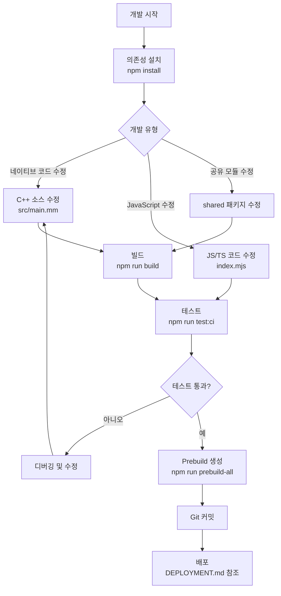

# 개발 가이드 (Development Guide)

이 문서는 `iohook-macos` 모노레포 프로젝트의 개발 방법을 설명합니다.

## 📁 프로젝트 구조

이 프로젝트는 npm workspace를 이용한 모노레포 구조로 구성되어 있습니다.

```
iohook-macos/
├── packages/
│   ├── macos/              # macOS 네이티브 이벤트 훅 패키지
│   │   ├── src/            # C++ 네이티브 소스 코드
│   │   ├── index.mjs       # JavaScript 진입점 (ESM)
│   │   ├── index.d.ts      # TypeScript 타입 정의
│   │   ├── binding.gyp     # node-gyp 빌드 설정
│   │   ├── examples/       # 예제 코드
│   │   │   ├── test/       # 테스트 스크립트 (ESM)
│   │   │   ├── electron/   # Electron 예제 (CommonJS)
│   │   │   └── typescript/ # TypeScript 예제
│   │   └── package.json
│   │
│   ├── shared/             # 공통 유틸리티 패키지 (내부 전용)
│   │   ├── event-emitter.mjs  # 이벤트 에미터
│   │   ├── event-types.mjs    # 이벤트 타입 매핑
│   │   ├── logger.mjs         # 로거
│   │   └── package.json
│   │
│   ├── windows/            # Windows 지원 (예정)
│   └── crossplatform/      # 크로스 플랫폼 래퍼 (예정)
│
├── package.json            # 루트 workspace 설정
├── DEVELOPMENT.md          # 이 문서
└── DEPLOYMENT.md           # 배포 가이드
```

### 패키지 설명

#### `@iohook/macos`
- macOS 시스템 이벤트 훅 네이티브 모듈
- C++ (Objective-C++) 소스 코드
- Core Graphics Event Services API 사용
- ESM (ES Modules) 방식
- node-gyp-build를 통한 빌드

#### `@iohook/shared`
- 공통 유틸리티 (EventEmitter, Logger, 이벤트 타입 매핑)
- 내부 전용 패키지 (`"private": true`)
- 다른 패키지들이 의존성으로 사용

#### `@iohook/windows` (예정)
- Windows 지원

#### `@iohook/crossplatform` (예정)
- 플랫폼별 패키지를 통합하는 크로스 플랫폼 래퍼

### 패키지 의존성

```mermaid
graph TD
    A[@iohook/macos] --> B[@iohook/shared]
    C[@iohook/windows] -.-> B
    D[@iohook/crossplatform] -.-> A
    D -.-> C
```

## 🛠️ 개발 환경 설정

### 필수 도구

1. **macOS 10.15+** (Catalina 이상)
2. **Xcode Command Line Tools**
   ```bash
   xcode-select --install
   ```

3. **Node.js 14+**
   ```bash
   node --version  # v14.0.0 이상
   ```

4. **Python 3** (node-gyp 빌드용)
   ```bash
   python3 --version
   ```

### 의존성 설치

```bash
# 프로젝트 클론
git clone https://github.com/hwanyong/iohook-macos.git
cd iohook-macos

# 전체 workspace 의존성 설치
npm install

# 또는 특정 패키지만 설치
npm install --workspace=packages/macos
```

### macOS 접근성 권한 설정

시스템 이벤트를 후킹하려면 접근성 권한이 필요합니다:

1. **시스템 환경설정** → **보안 및 개인 정보 보호** → **개인 정보 보호**
2. 왼쪽 패널에서 **손쉬운 사용** 선택
3. 자물쇠 아이콘 클릭 및 암호 입력
4. 터미널 또는 VSCode를 목록에 추가

또는 코드에서 확인:
```javascript
const iohook = require('@iohook/macos')
const result = iohook.checkAccessibilityPermissions()
console.log(result.hasPermissions)  // true/false
```

## 🔨 빌드 프로세스

### node-gyp 빌드

네이티브 모듈을 빌드하려면 node-gyp를 사용합니다.

#### binding.gyp 설정

`packages/macos/binding.gyp`는 네이티브 모듈의 빌드 설정을 정의합니다:

```json
{
  "targets": [
    {
      "target_name": "iohook-macos",
      "sources": [ "src/main.mm" ],
      "include_dirs": [
        "<!@(node -p \"require('node-addon-api').include\")"
      ],
      "xcode_settings": {
        "MACOSX_DEPLOYMENT_TARGET": "10.15",
        "CLANG_CXX_LANGUAGE_STANDARD": "c++14",
        "OTHER_CPLUSPLUSFLAGS": ["-ObjC++", "-std=c++14"]
      },
      "link_settings": {
        "libraries": [
          "-framework CoreGraphics",
          "-framework ApplicationServices",
          "-framework Foundation"
        ]
      }
    }
  ]
}
```

#### 빌드 명령어

```bash
# 루트에서 macos 패키지 빌드
npm run build:macos

# 또는 packages/macos에서 직접 빌드
cd packages/macos
npm run build

# 강제 재빌드
npm run rebuild
```

#### 빌드 산출물

빌드가 성공하면 다음 파일이 생성됩니다:

```
packages/macos/
└── build/
    └── Release/
        └── iohook-macos.node  # 네이티브 모듈 바이너리
```

### Electron용 빌드

Electron 환경에서는 Electron의 Node.js 버전과 ABI에 맞춰 빌드해야 합니다:

```bash
cd packages/macos

# Electron용 재빌드
npm run electron:rebuild

# 또는 electron-rebuild 직접 사용
npx electron-rebuild
```

## 📦 Prebuild 프로세스

배포를 위해 사전 빌드된 바이너리를 생성할 수 있습니다.

### prebuildify 사용

`prebuildify`는 여러 아키텍처용 바이너리를 미리 빌드합니다.

#### 아키텍처별 빌드

```bash
cd packages/macos

# ARM64 (Apple Silicon) 빌드
npm run prebuild-arm64

# x64 (Intel) 빌드
npm run prebuild-x64

# 모든 아키텍처 빌드
npm run prebuild-all
```

#### prebuilds 폴더 구조

빌드 후 다음과 같은 구조가 생성됩니다:

```
packages/macos/
└── prebuilds/
    ├── darwin-arm64+arm64/
    │   └── node.napi.node
    └── darwin-x64+x64/
        └── node.napi.node
```

### node-gyp-build의 동작 원리

`node-gyp-build`는 다음 순서로 네이티브 모듈을 로드합니다:

1. **Prebuilt 바이너리 탐색** (`prebuilds/` 폴더)
   - 현재 플랫폼 및 아키텍처에 맞는 prebuild 확인
   - Node.js ABI 버전 호환성 확인

2. **로컬 빌드 탐색** (`build/Release/` 폴더)
   - prebuild가 없으면 로컬 빌드 시도

3. **실패 시 에러**
   - 빌드가 필요함을 알림

이 방식으로 사용자는 대부분의 경우 빌드 없이 바로 설치할 수 있습니다.

## 🧪 테스트 실행

### 테스트 종류

프로젝트는 다양한 테스트를 제공합니다:

| 테스트 | 파일 | 설명 |
|--------|------|------|
| CI 테스트 | `test-ci.mjs` | 모듈 로딩, API, 권한 체크 |
| 기본 테스트 | `test.mjs` | 기본 기능 테스트 |
| 권한 테스트 | `test-permissions.mjs` | 접근성 권한 체크 |
| 종합 테스트 | `test-comprehensive.mjs` | 시스템 전체 테스트 |
| 성능 테스트 | `test-performance.mjs` | 성능 최적화 테스트 |
| 이벤트 테스트 | `test-events.mjs` | 이벤트 브리지 테스트 |
| 키보드 테스트 | `test-keyboard-events.mjs` | 키보드 이벤트 테스트 |
| 필터링 테스트 | `test-event-filtering.mjs` | 이벤트 필터링 테스트 |
| 수정 테스트 | `test-event-modification.mjs` | 이벤트 수정/소비 테스트 |
| 상세 테스트 | `test-detailed-events.mjs` | 상세 이벤트 데이터 테스트 |
| 수정 키 테스트 | `test-modifier-keys.mjs` | 수정 키 테스트 |
| 하드웨어 테스트 | `test-hardware-control.mjs` | 하드웨어 제어 테스트 |

### 루트에서 테스트 실행

```bash
# CI 테스트 (권장)
npm run test:ci

# 기본 테스트
npm run test:basic

# 권한 테스트
npm run test:permissions

# 종합 테스트
npm run test:comprehensive

# 성능 테스트
npm run test:performance

# 이벤트 테스트
npm run test:events

# 키보드 테스트
npm run test:keyboard
```

### 패키지 레벨에서 테스트 실행

```bash
cd packages/macos

# 개별 테스트 실행
npm run test          # CI 테스트
npm run test:basic
npm run test:permissions
npm run test:comprehensive
npm run test:performance
npm run test:events
npm run test:keyboard
npm run test:filtering
npm run test:modification
npm run test:detailed
npm run test:modifier
npm run test:hardware
```

### 테스트 결과 확인

성공적인 테스트는 다음과 같이 표시됩니다:

```
=== iohook-macos CI Test ===

1. Testing module loading...
✓ Module loaded successfully

2. Testing API availability...
  ✓ startMonitoring exists
  ✓ stopMonitoring exists
  ...

=== CI Test completed successfully! ===
```

## ⚡ Electron 통합

### electron-rebuild 사용법

Electron 앱에서 네이티브 모듈을 사용하려면 Electron용으로 재빌드해야 합니다:

```bash
cd packages/macos

# Electron 재빌드
npm run electron:rebuild

# 재빌드 후 Electron 실행
npm run electron:test
```

### Electron 예제 실행

```bash
# 루트에서
npm run electron

# 또는 packages/macos에서
cd packages/macos
npm run electron

# 개발 모드 (로깅 활성화)
npm run electron:dev
```

### Electron 환경에서의 주의사항

1. **Node Integration 필요**
   ```javascript
   const mainWindow = new BrowserWindow({
     webPreferences: {
       nodeIntegration: true,
       contextIsolation: false
     }
   })
   ```

2. **Main Process에서 사용**
   - 네이티브 모듈은 Main Process에서만 로드
   - Renderer Process로는 IPC를 통해 통신

3. **재빌드 필수**
   - Electron 버전이 바뀌면 재빌드 필요
   - `npm run electron:rebuild` 실행

## 📘 TypeScript 사용

### 타입 정의 파일

`packages/macos/index.d.ts`에 전체 타입이 정의되어 있습니다:

```typescript
export interface EventData {
  type: number           // CGEventType integer
  x?: number            // X coordinate (mouse events)
  y?: number            // Y coordinate (mouse events)
  timestamp: number     // Event timestamp
  processId?: number    // Source process ID
  keyCode?: number      // Key code (keyboard events)
  hasKeyCode?: boolean  // Whether keyCode is available
}

export interface AccessibilityPermissionsResult {
  hasPermissions: boolean
  message: string
}

// ... 더 많은 타입 정의
```

### TypeScript 예제 실행

```bash
# 루트에서
npm run typescript:example

# 또는 packages/macos에서
cd packages/macos
npm run typescript:example
```

### ts-node 설정

TypeScript 예제는 `ts-node`로 실행됩니다:

```bash
# TypeScript 예제 직접 실행
npx ts-node packages/macos/examples/typescript/typescript-example.ts

# TypeScript 컴파일
cd packages/macos
npm run typescript:compile
```

## 📊 개발 워크플로우



### 일반적인 개발 순서

1. **초기 설정**
   ```bash
   npm install
   npm run build:macos
   ```

2. **개발 사이클**
   ```bash
   # 코드 수정
   # ...
   
   # 빌드
   npm run build:macos
   
   # 테스트
   npm run test:ci
   ```

3. **Prebuild 생성 (배포 전)**
   ```bash
   cd packages/macos
   npm run prebuild-all
   ```

4. **배포**
   - `DEPLOYMENT.md` 참조

## 🔧 일반적인 문제 해결

### 빌드 실패

**문제**: `gyp ERR! build error`

**해결 방법**:
```bash
# Xcode Command Line Tools 재설치
xcode-select --install

# node-gyp 글로벌 설치
npm install -g node-gyp

# 캐시 정리 및 재빌드
rm -rf build node_modules package-lock.json
npm install
npm run rebuild
```

### 권한 문제

**문제**: `Accessibility permissions not granted`

**해결 방법**:
1. 시스템 환경설정 → 보안 및 개인 정보 보호 → 개인 정보 보호 → 손쉬운 사용
2. 터미널/VSCode/Node 추가
3. 앱 재시작

### Electron 통합 문제

**문제**: `Error: The module was compiled against a different Node.js version`

**해결 방법**:
```bash
# Electron용 재빌드
npm run electron:rebuild

# 또는 수동으로
npx electron-rebuild -f -w @iohook/macos
```

### M1/M2 Mac에서의 주의사항

**Rosetta 환경 vs Native ARM64**

1. **Native ARM64 (권장)**
   ```bash
   # ARM64 빌드
   npm run prebuild-arm64
   ```

2. **Rosetta 환경**
   ```bash
   # x64 빌드
   arch -x86_64 npm run prebuild-x64
   ```

3. **Universal 빌드**
   ```bash
   # 양쪽 모두 빌드
   npm run prebuild-all
   ```

### 모듈 로드 실패

**문제**: `Cannot find module 'iohook-macos.node'`

**해결 방법**:
```bash
# Prebuild 확인
ls -la packages/macos/prebuilds/

# 로컬 빌드 확인
ls -la packages/macos/build/Release/

# 재빌드
npm run build:macos
```

### workspace 의존성 문제

**문제**: `Cannot find module '@iohook/shared'`

**해결 방법**:
```bash
# 루트에서 전체 재설치
rm -rf node_modules packages/*/node_modules
npm install

# workspace 링크 재생성
npm install --workspaces
```

## 🚀 배포 프로세스

배포 관련 상세 정보는 [`DEPLOYMENT.md`](./DEPLOYMENT.md)를 참조하세요.

### 배포 요약

1. **버전 업데이트**
   ```bash
   npm run release:patch  # 0.1.0 → 0.1.1
   npm run release:minor  # 0.1.0 → 0.2.0
   npm run release:major  # 0.1.0 → 1.0.0
   ```

2. **npm 배포**
   - GitHub Actions가 자동으로 npm에 배포
   - 수동 배포: `npm publish --workspace=packages/macos`

3. **GitHub 릴리스**
   - 태그 푸시 시 자동 생성

## 📚 참고 자료

- [Node.js N-API](https://nodejs.org/api/n-api.html)
- [node-gyp](https://github.com/nodejs/node-gyp)
- [node-gyp-build](https://github.com/prebuild/node-gyp-build)
- [prebuildify](https://github.com/prebuild/prebuildify)
- [Core Graphics Event Services](https://developer.apple.com/documentation/coregraphics/core_graphics_event_services)
- [npm workspaces](https://docs.npmjs.com/cli/v8/using-npm/workspaces)

---

**문의 및 기여**: [GitHub Issues](https://github.com/hwanyong/iohook-macos/issues)