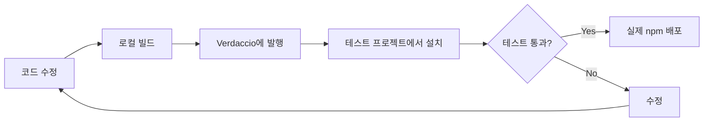

# Verdaccio 로컬 배포 테스트 가이드

이 문서는 Verdaccio를 사용하여 `iohook-macos` monorepo 패키지의 로컬 배포 테스트 환경을 구성하는 방법을 설명합니다.
https://verdaccio.org/docs/docker/

## 📋 목차

- [Verdaccio란?](#verdaccio란)
- [왜 Verdaccio를 사용하는가?](#왜-verdaccio를-사용하는가)
- [설치 및 설정](#설치-및-설정)
- [기본 워크플로우](#기본-워크플로우)
- [monorepo 환경에서의 활용](#monorepo-환경에서의-활용)
- [자동화 스크립트](#자동화-스크립트)
- [문제 해결](#문제-해결)
- [모범 사례](#모범-사례)

## Verdaccio란?

Verdaccio는 경량 프라이빗 npm 레지스트리입니다. 로컬 환경에서 npm 패키지를 테스트하고 배포하기 위한 도구로, 실제 npm 배포 전에 패키지의 동작을 검증할 수 있습니다.

### 주요 특징

- 🚀 **빠른 설치**: 몇 분 안에 프라이빗 레지스트리 구축
- 🔄 **실제 환경 시뮬레이션**: npm publish/install과 동일한 워크플로우
- 📦 **monorepo 지원**: 여러 패키지 간 의존성 테스트에 이상적
- 💾 **오프라인 작업**: 인터넷 연결 없이도 패키지 관리
- 🔒 **프라이빗**: 로컬 환경에서만 접근 가능

## 왜 Verdaccio를 사용하는가?

### 실제 npm 배포 전 테스트



### 주요 이점

1. **안전한 테스트**: 실제 npm 레지스트리에 영향 없이 테스트
2. **의존성 검증**: monorepo 패키지 간 의존성 확인
3. **설치 프로세스 확인**: 실제 사용자 관점에서 설치 과정 검증
4. **바이너리 배포 테스트**: 네이티브 모듈의 prebuild 바이너리 테스트
5. **빠른 반복**: 버전 관리 없이 빠르게 반복 테스트 가능

## 설치 및 설정

### 1. Verdaccio 설치

```bash
# 전역 설치 (권장)
npm install -g verdaccio

# 또는 npx로 실행 (설치 없이)
npx verdaccio
```

### 2. Verdaccio 실행

```bash
# 기본 포트(4873)에서 실행
verdaccio

# 커스텀 설정 파일 사용
verdaccio --config ./verdaccio-config.yaml
```

실행 후 다음과 같은 메시지가 표시됩니다:

```
warn --- http address - http://localhost:4873/ - verdaccio/5.x.x
```

### 3. 사용자 생성

새 터미널을 열고 사용자를 생성합니다:

```bash
npm adduser --registry http://localhost:4873/

# 프롬프트에 따라 입력
Username: test-user
Password: ****
Email: test@example.com
```

### 4. npm 레지스트리 설정

#### 방법 1: 전역 설정 (모든 패키지에 적용)

```bash
# Verdaccio를 기본 레지스트리로 설정
npm set registry http://localhost:4873/
```

#### 방법 2: 스코프별 설정 (권장)

```bash
# @iohook 스코프만 Verdaccio 사용
npm config set @iohook:registry http://localhost:4873/
```

#### 방법 3: .npmrc 파일 사용

프로젝트 루트에 `.npmrc` 파일 생성:

```ini
# 스코프별 레지스트리 설정
@iohook:registry=http://localhost:4873/

# 또는 전체 레지스트리 설정
# registry=http://localhost:4873/
```

## 기본 워크플로우

### 1. Verdaccio 시작

```bash
# 터미널 1: Verdaccio 서버 실행
verdaccio
```

### 2. 패키지 발행

```bash
# 터미널 2: 패키지 발행
cd packages/shared
npm publish --registry http://localhost:4873/

cd ../macos
npm publish --registry http://localhost:4873/
```

### 3. 테스트 프로젝트에서 설치

```bash
# 새 테스트 프로젝트 생성
mkdir test-project
cd test-project
npm init -y

# Verdaccio에서 패키지 설치
npm install @iohook/macos --registry http://localhost:4873/
```

### 4. 동작 확인

```javascript
// test.mjs
import iohook from '@iohook/macos';

console.log('iohook loaded:', iohook);
console.log('Available methods:', Object.keys(iohook));
```

```bash
node test.mjs
```

## monorepo 환경에서의 활용

### 프로젝트 구조

```
iohook-macos/
├── packages/
│   ├── shared/         # 공통 유틸리티
│   ├── macos/          # macOS 네이티브 모듈
│   ├── windows/        # Windows 지원
│   └── crossplatform/  # 크로스 플랫폼 래퍼
└── package.json
```

### 의존성 그래프

```mermaid
graph TD
    A[@iohook/macos] --> B[@iohook/shared]
    C[@iohook/windows] --> B
    D[@iohook/crossplatform] --> A
    D --> C
```

### 발행 순서

의존성이 있는 패키지를 먼저 발행해야 합니다:

```bash
# 1. shared 패키지 발행 (다른 패키지들이 의존)
cd packages/shared
npm publish --registry http://localhost:4873/

# 2. 플랫폼별 패키지 발행
cd ../macos
npm publish --registry http://localhost:4873/

cd ../windows
npm publish --registry http://localhost:4873/

# 3. crossplatform 패키지 발행 (macos, windows에 의존)
cd ../crossplatform
npm publish --registry http://localhost:4873/
```

### 버전 업데이트 워크플로우

```bash
# 1. 코드 수정 후 버전 업데이트
cd packages/macos
npm version patch  # 0.1.0 -> 0.1.1

# 2. Verdaccio에 발행
npm publish --registry http://localhost:4873/

# 3. 의존하는 패키지 업데이트
cd ../crossplatform
npm install @iohook/macos@latest --registry http://localhost:4873/

# 4. crossplatform도 버전 업데이트 후 발행
npm version patch
npm publish --registry http://localhost:4873/
```

## 자동화 스크립트

### package.json 스크립트 추가

루트 [`package.json`](package.json:1)에 다음 스크립트를 추가할 수 있습니다:

```json
{
  "scripts": {
    "verdaccio:start": "verdaccio",
    "verdaccio:publish:shared": "npm publish --workspace=packages/shared --registry http://localhost:4873/",
    "verdaccio:publish:macos": "npm publish --workspace=packages/macos --registry http://localhost:4873/",
    "verdaccio:publish:windows": "npm publish --workspace=packages/windows --registry http://localhost:4873/",
    "verdaccio:publish:crossplatform": "npm publish --workspace=packages/crossplatform --registry http://localhost:4873/",
    "verdaccio:publish:all": "npm run verdaccio:publish:shared && npm run verdaccio:publish:macos && npm run verdaccio:publish:windows && npm run verdaccio:publish:crossplatform"
  }
}
```

### 사용 예시

```bash
# Verdaccio 시작 (별도 터미널)
npm run verdaccio:start

# 모든 패키지 발행
npm run verdaccio:publish:all

# 특정 패키지만 발행
npm run verdaccio:publish:macos
```

### 고급 자동화 스크립트

`scripts/publish-local.sh` 파일을 생성:

```bash
#!/bin/bash

# Verdaccio가 실행 중인지 확인
if ! curl -s http://localhost:4873/ > /dev/null; then
    echo "❌ Verdaccio가 실행되지 않았습니다."
    echo "다른 터미널에서 'npm run verdaccio:start'를 실행하세요."
    exit 1
fi

echo "📦 로컬 레지스트리에 패키지 발행 중..."

# shared 패키지 발행
echo ""
echo "1️⃣ @iohook/shared 발행..."
npm publish --workspace=packages/shared --registry http://localhost:4873/

# macos 패키지 발행
echo ""
echo "2️⃣ @iohook/macos 발행..."
npm publish --workspace=packages/macos --registry http://localhost:4873/

# windows 패키지 발행 (구현된 경우)
echo ""
echo "3️⃣ @iohook/windows 발행..."
npm publish --workspace=packages/windows --registry http://localhost:4873/ 2>/dev/null || echo "⚠️ windows 패키지 건너뜀"

# crossplatform 패키지 발행
echo ""
echo "4️⃣ @iohook/crossplatform 발행..."
npm publish --workspace=packages/crossplatform --registry http://localhost:4873/ 2>/dev/null || echo "⚠️ crossplatform 패키지 건너뜀"

echo ""
echo "✅ 모든 패키지 발행 완료!"
echo ""
echo "테스트 프로젝트에서 설치:"
echo "  npm install @iohook/macos --registry http://localhost:4873/"
```

실행 권한 부여 및 실행:

```bash
chmod +x scripts/publish-local.sh
./scripts/publish-local.sh
```

## Verdaccio 설정 커스터마이징

### 기본 설정 파일 위치

```bash
# macOS/Linux
~/.config/verdaccio/config.yaml

# Windows
C:\Users\{username}\.config\verdaccio\config.yaml
```

### 커스텀 설정 예시

`verdaccio-config.yaml` 파일 생성:

```yaml
# 저장소 위치
storage: ./verdaccio-storage

# 인증 설정
auth:
  htpasswd:
    file: ./htpasswd
    # 최대 사용자 수 (-1 = 무제한)
    max_users: -1

# 업스트림 레지스트리 (npm)
uplinks:
  npmjs:
    url: https://registry.npmjs.org/
    # 캐시 타임아웃 (분)
    cache: true

# 패키지 접근 제어
packages:
  # @iohook 스코프 패키지
  '@iohook/*':
    access: $all
    publish: $authenticated
    unpublish: $authenticated
    proxy: npmjs

  # 다른 모든 패키지
  '**':
    access: $all
    publish: $authenticated
    unpublish: $authenticated
    proxy: npmjs

# 로그 설정
logs:
  - { type: stdout, format: pretty, level: http }

# 웹 UI 설정
web:
  enable: true
  title: iohook-macos Local Registry

# 서버 설정
listen:
  - http://localhost:4873/

# 최대 body 크기 (기본: 10mb)
max_body_size: 100mb
```

커스텀 설정으로 실행:

```bash
verdaccio --config ./verdaccio-config.yaml
```

## 문제 해결

### 1. Verdaccio 연결 실패

**문제**: `npm install` 시 Verdaccio 연결 실패

**해결 방법**:

```bash
# Verdaccio가 실행 중인지 확인
curl http://localhost:4873/

# 프로세스 확인
ps aux | grep verdaccio

# Verdaccio 재시작
pkill -f verdaccio
verdaccio
```

### 2. 패키지 발행 실패

**문제**: `npm publish` 시 권한 오류

**해결 방법**:

```bash
# 사용자 재등록
npm adduser --registry http://localhost:4873/

# 로그인 확인
npm whoami --registry http://localhost:4873/
```

### 3. 캐시 문제

**문제**: 새 버전이 반영되지 않음

**해결 방법**:

```bash
# npm 캐시 정리
npm cache clean --force

# Verdaccio 저장소 초기화 (주의: 모든 데이터 삭제)
rm -rf ~/.local/share/verdaccio/storage/*
# 또는 커스텀 설정의 storage 경로
rm -rf ./verdaccio-storage/*
```

### 4. 버전 충돌

**문제**: 같은 버전을 다시 발행할 수 없음

**해결 방법**:

```bash
# 방법 1: 버전 업데이트
npm version patch

# 방법 2: Verdaccio에서 해당 버전 삭제
npm unpublish @iohook/macos@1.0.0 --registry http://localhost:4873/

# 방법 3: --force 플래그 사용 (비권장)
npm publish --force --registry http://localhost:4873/
```

### 5. 네이티브 모듈 빌드 오류

**문제**: 설치 시 prebuild 바이너리를 찾지 못함

**해결 방법**:

```bash
# prebuild 바이너리 생성 확인
cd packages/macos
npm run prebuild-all

# prebuilds 폴더 확인
ls -la prebuilds/

# npm 패키지에 포함되는지 확인
npm pack
tar -tzf iohook-macos-*.tgz | grep prebuilds
```

### 6. 레지스트리 설정 복원

**문제**: 테스트 후 원래 레지스트리로 복원

**해결 방법**:

```bash
# 전역 레지스트리 복원
npm config delete registry

# 또는 명시적으로 설정
npm set registry https://registry.npmjs.org/

# 스코프별 설정 제거
npm config delete @iohook:registry

# 설정 확인
npm config list
```

## 모범 사례

### 1. 별도 터미널 사용

```bash
# 터미널 1: Verdaccio 서버
verdaccio

# 터미널 2: 개발 작업
npm run build:macos
npm run verdaccio:publish:all

# 터미널 3: 테스트
cd test-project
npm install @iohook/macos --registry http://localhost:4873/
```

### 2. 스코프별 레지스트리 사용

전역 레지스트리를 변경하는 대신 스코프별 설정 권장:

```bash
# .npmrc 파일에 추가
@iohook:registry=http://localhost:4873/
```

이렇게 하면:
- `@iohook/*` 패키지는 Verdaccio에서 가져옴
- 다른 패키지는 공식 npm 레지스트리에서 가져옴

### 3. 버전 관리 전략

```bash
# 로컬 테스트용 버전 (예: 1.0.0-local.1)
npm version prerelease --preid=local

# Verdaccio에 발행
npm publish --registry http://localhost:4873/ --tag local

# 테스트 프로젝트에서 설치
npm install @iohook/macos@local --registry http://localhost:4873/
```

### 4. CI/CD 통합

```yaml
# .github/workflows/test-local.yml
name: Local Registry Test

on: [pull_request]

jobs:
  test:
    runs-on: macos-latest
    steps:
      - uses: actions/checkout@v3

      - name: Setup Node.js
        uses: actions/setup-node@v3
        with:
          node-version: '18'

      - name: Start Verdaccio
        run: |
          npm install -g verdaccio
          verdaccio &
          sleep 5

      - name: Setup registry
        run: |
          npm adduser --registry http://localhost:4873/ << EOF
          test
          test
          test@example.com
          EOF

      - name: Publish packages
        run: |
          npm run verdaccio:publish:all

      - name: Test installation
        run: |
          mkdir test-project
          cd test-project
          npm init -y
          npm install @iohook/macos --registry http://localhost:4873/
```

### 5. 문서화

프로젝트에 Verdaccio 사용법을 문서화:

```markdown
## 로컬 테스트 방법

1. Verdaccio 시작: `npm run verdaccio:start`
2. 패키지 발행: `npm run verdaccio:publish:all`
3. 테스트 프로젝트에서 설치:
   ```bash
   npm install @iohook/macos --registry http://localhost:4873/
   ```
```

## 실전 예시: 완전한 워크플로우

### 시나리오: macOS 패키지 수정 후 테스트

```bash
# 1. 코드 수정
cd packages/macos
# ... src/main.mm 수정 ...

# 2. 빌드
npm run build

# 3. 버전 업데이트 (로컬 테스트용)
npm version prerelease --preid=local
# 1.0.6 -> 1.0.7-local.0

# 4. Verdaccio 시작 (별도 터미널)
verdaccio

# 5. Verdaccio에 발행
npm publish --registry http://localhost:4873/

# 6. 테스트 프로젝트 생성 및 설치
cd ../..
mkdir test-installation
cd test-installation
npm init -y
npm install @iohook/macos@local --registry http://localhost:4873/

# 7. 동작 확인
cat > test.mjs << 'EOF'
import iohook from '@iohook/macos';

console.log('✓ Module loaded successfully');
console.log('✓ Available methods:', Object.keys(iohook));

// 권한 확인
const result = iohook.checkAccessibilityPermissions();
console.log('✓ Permissions check:', result);
EOF

node test.mjs

# 8. 테스트 성공 시 실제 npm 배포
cd ../packages/macos
npm version patch  # 1.0.7-local.0 -> 1.0.7
npm publish

# 9. 정리
cd ../../test-installation
cd ..
rm -rf test-installation
npm config delete @iohook:registry  # 레지스트리 복원
```

## 참고 자료

- [Verdaccio 공식 문서](https://verdaccio.org/)
- [npm 레지스트리 설정](https://docs.npmjs.com/cli/v8/using-npm/config#registry)
- [npm workspaces](https://docs.npmjs.com/cli/v8/using-npm/workspaces)
- [iohook-macos 배포 가이드](./DEPLOYMENT.md)
- [iohook-macos 개발 가이드](./DEVELOPMENT.md)

## 추가 팁

### Web UI 사용

Verdaccio는 웹 UI를 제공합니다:

```
http://localhost:4873/
```

웹 UI에서 확인 가능한 정보:
- 발행된 패키지 목록
- 패키지 버전 히스토리
- 패키지 메타데이터
- 다운로드 통계

### 영구 실행

Verdaccio를 백그라운드에서 영구 실행:

```bash
# pm2 사용
npm install -g pm2
pm2 start verdaccio
pm2 save

# 또는 nohup 사용
nohup verdaccio &
```

### 다른 포트 사용

```bash
# 환경 변수로 포트 변경
VERDACCIO_PORT=5000 verdaccio

# 또는 설정 파일에서 변경
# config.yaml
listen: http://localhost:5000/
```

---

**문의 및 기여**: [GitHub Issues](https://github.com/hwanyong/iohook-macos/issues)